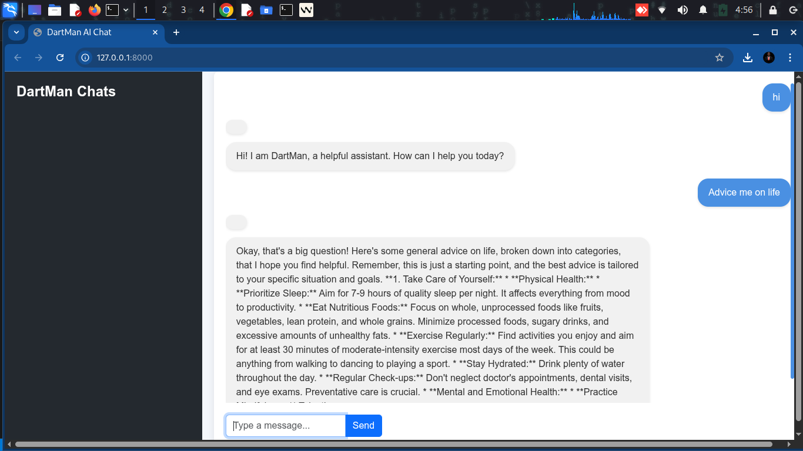

# Image Recognition & Gemini Summarizer

[](https://github.com/OnpointSoftwares/AI-image-summerizer/stargazers)
[](https://github.com/OnpointSoftwares/AI-image-summerizer/network/members)
[](https://github.com/OnpointSoftwares/AI-image-summerizer/blob/main/LICENSE)
[](https://github.com/OnpointSoftwares/AI-image-summerizer/issues)
[](https://github.com/OnpointSoftwares/AI-image-summerizer/pulls)

<p align="center">
  
</p>

## 🚀 Project Overview

A cutting-edge desktop application that combines image recognition with Google's Gemini AI to provide intelligent summarization capabilities. This tool simplifies the process of analyzing images and generating meaningful summaries, making it perfect for content creators, researchers, and anyone looking to extract insights from visual data.

## 🎯 Key Features

- 🎨 **Modern GUI Interface:** Clean and intuitive Tkinter-based interface with responsive design
- 📸 **Image Processing:** Support for multiple image formats (JPG, PNG, BMP)
- 📝 **Smart Summarization:** Leveraging Google's Gemini AI for accurate and concise summaries
- 🌐 **Cross-Platform:** Compatible with Linux, Windows, and macOS
- 🔐 **Secure Integration:** Easy Gemini API key configuration
- 📚 **Documentation:** Comprehensive setup and usage guides

## 📈 Project Statistics

<p align="center">
  
</p>

<p align="center">
  
</p>

## 📋 Project Structure

```
AI-image-summerizer/
├── src/
│   ├── app.py           # Main application code
│   ├── gemini_api.py    # Gemini API integration
│   └── views.py         # UI components
├── data/
│   └── raw/            # Raw data files
├── screenshots/         # Application screenshots
├── requirements.txt     # Project dependencies
└── README.md           # Project documentation
```

## Setup Instructions
1. **Clone the Repository**
   ```bash
   git clone https://github.com/OnpointSoftwares/AI-image-summerizer.git
   cd AI-image-summerizer
   ```
2. **Install Dependencies**
   Ensure you have Python 3.8+ and pip installed. Then run:
   ```bash
   pip install -r requirements.txt
   ```
   > If you encounter issues with `python3-tk`, install it via your OS package manager (e.g., `sudo apt install python3-tk` on Ubuntu).

3. **Set Up Gemini API Key**
   - Open `src/gemini_api.py` and set your Gemini API key in the `GEMINI_API_KEY` variable.

4. **Run the Application**
   ```bash
   python3 src/app.py
   ```

## Usage Guide
1. **Launch the App:** The main window will appear with a clean interface.
2. **Select an Image:** Click "Select Image" and choose any image file (JPG, PNG, BMP).
3. **Describe the Image:** Enter a brief description or context in the text box.
4. **Summarize:** Click "Summarize with Gemini" to get a concise summary.
5. **View Results:** The summary will appear below the description box.

## Customization
- **UI Enhancements:** Modify `src/app.py` to adjust layout, colors, or add features.
- **API Integration:** Update `src/gemini_api.py` for advanced Gemini API options.
- **Add Image Analysis:** Integrate local or cloud-based AI models as needed.

